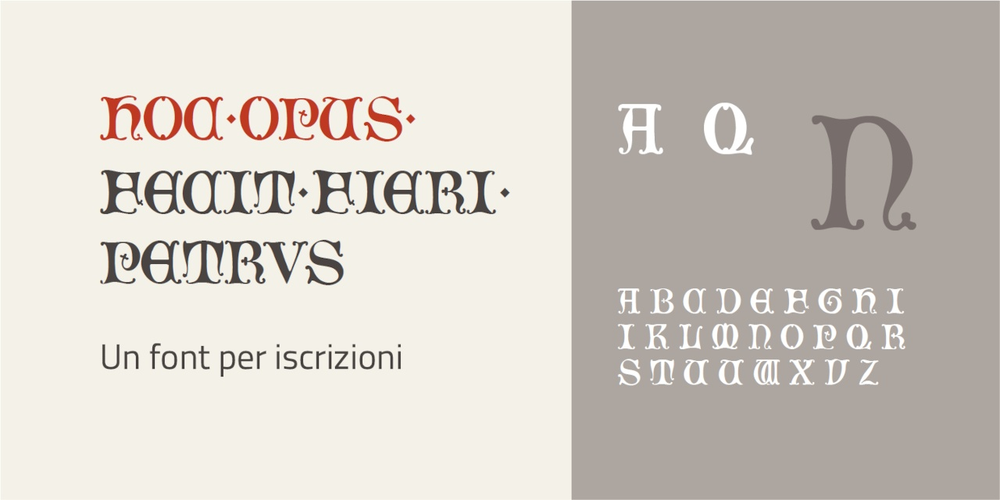

# Hoc opus
- Versione 1.0: versione iniziale.

Per testare il font, vedere la [pagina interattiva](https://m-casanova.github.io/HocOpus/).

## Descrizione

Il font **Hoc opus** è basato su scansioni di disegni da una [raccolta del 1850 circa](https://archive.org/details/illuminatediniti00unse/page/13/mode/1up).

Sono presenti varianti per le lettere _M T U V W_, accessibili tramite caratteristica '**ss01**'.
